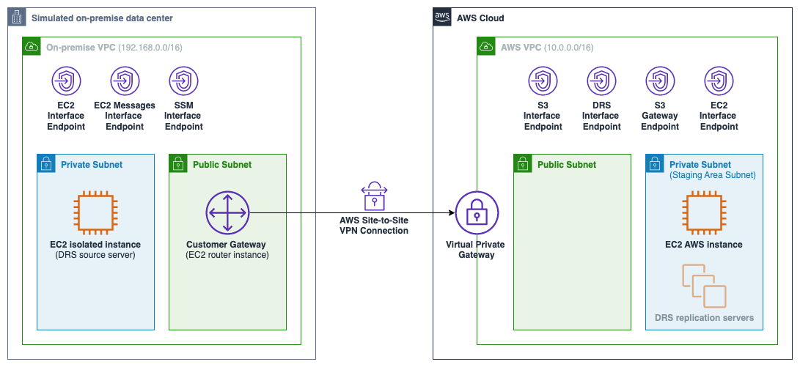

# AWS Elastic Disaster Recovery Setup with AWS Site-to-Site VPN Connection

This sample gives an overview on how to set up AWS Elastic Disaster Recovery (DRS) using an AWS Site-To-Site VPN
connection between a simulated on-premise environment and the AWS side VPC. The AWS Site-to-Site VPN uses pre-shared
keys and static routes.
[OpenSwan](https://openswan.org/) is used to setup the IPsec tunnel between the Virtual Private Gateway on the AWS side
and the Customer Gateway on the on-premise side. Linux instances are used as source servers. This sample contains the
AWS CDKv2 code to deploy the solution.

## Architecture



1. **On-Premise Network**: This VPC simulates the on-premise side environment.
2. **AWS VPC**: This is the VPC which is used for the staging area subnet where the DRS replication server instances are
   created.
3. **[AWS Site-to-Site VPN](https://aws.amazon.com/vpn/site-to-site-vpn/)**: Connection between the AWS VPC and the
   on-premise VPC using [OpenSwan](https://openswan.org/) for the IPsec tunnel.
4. **On-premise private instance**: This is the on-premise instance which is replicated to the Staging Area Subnet using
   AWS Elastic Disaster Recovery.
   The [DRS Replication Agent](https://docs.aws.amazon.com/drs/latest/userguide/agent-installation.html) is installed on
   this machine.
5. **On-premise router instance**: This on-premise instance acts as Customer Gateway for the VPN connection. OpenSwan is
   installed on this instance in order to establish a VPN connection with the Virtual Private Gateway on the AWS side.
6. **AWS EC2 instance**: A ping command from the on-premise side can be sent to this instance in order to verify that
   the VPN connection is established.
7. **AWS Side [VPC endpoints](https://docs.aws.amazon.com/vpc/latest/privatelink/concepts.html)**: The following
   endpoints are used on the AWS side.
    1. **S3 Interface Endpoint**: Used during replication agent installation (`--s3-endpoint`) on on-premise instance.
       Enables replication agent to connect to S3 via the VPN connecting using private IP addresses.
    2. **DRS Interface Endpoint**: Used during replication agent installation (`--endpoint`) on on-premise instance.
       Enables replication agent to communicate with Elastic Disaster Recovery service over the VPN.
    3. **S3 Gateway Endpoint**: Used by the replication servers to download the replication software from S3.
    4. **EC2 Interface Endpoint**: Used to establish connectivity to EC2 endpoint from the staging area subnet.
8. **On-premise Side VPC endpoints**: These interface endpoints are used to enable the use
   of [SSM Session Manager](https://docs.aws.amazon.com/systems-manager/latest/userguide/session-manager.html) to log
   into EC2 instances in an private subnet. For more information visit
   the [User Guide](https://docs.aws.amazon.com/systems-manager/latest/userguide/setup-create-vpc.html).
9. **DRS replication servers**: These replication servers are created from the source servers once AWS Elastic Disaster
   Recovery is fully set up.

## Prerequisites

1. AWS account.
2. [CDK](https://docs.aws.amazon.com/cdk/v2/guide/getting_started.html) installed and configured.
3. [npm](https://npmjs.org) installed.

## Deployment Steps

### Clone Repository and Deploy CDK Stack

1. Git clone this repository.
2. Optionally change the parameters in `config/parameters.yaml`.
3. Install all dependencies.
   ```
   npm install
   ```
3. [Bootstrap](https://docs.aws.amazon.com/cdk/v2/guide/bootstrapping.html) your CDK environment. 
   ```
   cdk bootstrap
   ```
5. Deploy the CDK stack.
   ```
   cdk deploy
   ```

### Setup VPN Connection

1. Sign in to the AWS Management Console and open the Amazon VPC console at [https://console.aws.amazon.com/vpc/](https://console.aws.amazon.com/vpc/).
2. In the navigation pane, choose **Site-to-Site VPN connections**.
3. Select your VPN connection and choose **Download Configuration**.
4. Select `Openswan` as vendor and choose **Download**.
5. Open the EC2 console at [https://console.aws.amazon.com/ec2/](https://console.aws.amazon.com/ec2/).
6. In the navigation pane, choose **Instances**. In the list of instances, select the `On-premise router instance`.
7. Connect to the instance using [Session Manager](https://docs.aws.amazon.com/AWSEC2/latest/UserGuide/session-manager.html)
8. Execute the following commands and use the configurations from the downloaded configuration file.
   ```
   # Change to superuser
   sudo su
   
   # Install openswan 
   yum install openswan -y
    
   # Configure IP forwarding, reverse path filtering, and packet routing
   echo 'net.ipv4.ip_forward = 1' >> /etc/sysctl.conf
   echo 'net.ipv4.conf.default.rp_filter = 0' >> /etc/sysctl.conf
   echo 'net.ipv4.conf.default.accept_source_route = 0' >> /etc/sysctl.conf
   
   # Apply changes
   sysctl -p
   
   # Add tunnel details to /etc/ipsec.d/aws.conf
   vi /etc/ipsec.d/aws.conf
   # Update 'leftid' and 'right' according to the downloaded configuration file
   # Remove the line 'auth=esp'
   # Add the on-premise CIDR range to 'leftsubnet'
   # Add the AWS CIDR range to 'rightsubnet'
   # ---------- EXAMPLE TUNNEL CONFIGURATION ----------
   conn Tunnel1
       authby=secret
       auto=start
       left=%defaultroute
       leftid=<CUSTOMER_GATEWAY_PUBLIC_IP>        
       right=<VIRTUAL_PRIVATE_GATEWAY_PUBLIC_IP>
       type=tunnel
       ikelifetime=8h
       keylife=1h
       phase2alg=aes128-sha1;modp1024
       ike=aes128-sha1;modp1024
   #	auth=esp                             # remove this line
       keyingtries=%forever
       keyexchange=ike
       leftsubnet=<ON_PREMISE_IP_RANGE>     # e.g. 192.168.0.0/16
       rightsubnet=<AWS_IP_RANGE>           # e.g. 10.0.0.0/16
       dpddelay=10
       dpdtimeout=30
       dpdaction=restart_by_peer
   # ---------- EXAMPLE TUNNEL CONFIGURATION ----------
   
   # Add pre-shared key (PSK) to /etc/ipsec.d/aws.secrets
   vi /etc/ipsec.d/aws.secrets
   # Use the configuration according to the downloaded configuration file
   # ---------- EXAMPLE PSK CONFIGURATION ----------
   <CUSTOMER_GATEWAY_PUBLIC_IP> <VIRTUAL_PRIVATE_GATEWAY_PUBLIC_IP>: PSK "<YOUR_PSK>"
   # ---------- EXAMPLE PSK CONFIGURATION ----------
   
   # Start IPsec service
   systemctl start ipsec
   
   # Check IPsec service status
   systemctl status ipsec
   
   # Validate connectivity by issuing a ping command to the EC2 instance on the AWS side
   # Get IP from CDK Output 'AwsElasticDisasterRecoveryWithAwsSiteToSiteVpnStack.AWSServerPrivateIP'
   ping <AWS_INSTANCE_PRIVATE_IP>
   ```
9. Open the VPC console at [https://console.aws.amazon.com/vpc/](https://console.aws.amazon.com/vpc/).
10. In the navigation pane, choose **Site-to-Site VPN connections**.
11. Select your VPN connection and choose **Tunnel details**.
12. You should see the status of Tunnel 1 as `Up`. This might take a few minutes to update.

Note: For this sample only one IPsec tunnel is used to establish the VPN connection. In production use-cases it is important to [configure both tunnels](https://docs.aws.amazon.com/vpn/latest/s2svpn/VPNTunnels.html) for redundancy.


### Setup Elastic Disaster Recovery

1. Open the AWS Elastic Disaster Recovery (DRS) console at [https://console.aws.amazon.com/drs/home/](https://console.aws.amazon.com/drs/home/).
2. In the navigation pane, choose **Settings**.
3. Choose **Edit**.
   1. Choose  `AWS VPC Private/Isolated Subnet` for the staging area subnet.
   2. Choose `t3.large` as replication server instance type.
   3. Check `Use private IP for data replication (VPN, DirectConnect, VPC peering)`.
4. Choose **Save changes**.

### Install the AWS Replication Agent

For the installation via a VPN connection the S3 Interface Endpoint and the DRS Interface Endpoint in the AWS VPC are needed.

1. Open the Amazon VPC console at [https://console.aws.amazon.com/vpc/](https://console.aws.amazon.com/vpc/).
2. In the navigation pane, choose **Endpoints**.
3. Select the S3 interface endpoint of the AWS VPC and choose **Details**.
4. Under **DNS names** note down the first DNS name and remove the `*.`.
   ```
   Example: vpce-0123456789-abcdef.s3.us-east-1.vpce.amazonaws.com
   ```
5. Select the DRS interface endpoint of the AWS VPC and choose **Details**.
6. Under **DNS names** note down the first DNS name.
   ```
   Example: vpce-0123456789-abcdef.drs.us-east-1.vpce.amazonaws.com
   ```
7. Open the EC2 console at [https://console.aws.amazon.com/ec2/](https://console.aws.amazon.com/ec2/).
8. In the navigation pane, choose **Instances**. In the list of instances, select the `On-premise private instance`.
9. Connect to the instance using [Session Manager](https://docs.aws.amazon.com/AWSEC2/latest/UserGuide/session-manager.html)
10. Execute the following commands as described in
   the [User Guide](https://docs.aws.amazon.com/drs/latest/userguide/linux-agent.html) and use the S3 and DRS interface endpoint DNS names of the previous steps.
   ```
   # Change to superuser
   sudo su
   
   # Change to home directory
   cd ~
   
   # Download the agent installer to your source server
   # See instructions in https://docs.aws.amazon.com/drs/latest/userguide/linux-agent.html
   # For usage in us-east-1 region execute
   wget -O ./aws-replication-installer-init.py https://aws-elastic-disaster-recovery-us-east-1.s3.us-east-1.amazonaws.com/latest/linux/aws-replication-installer-init.py
   
   # Run installation script using the S3 Interface Dndpoint and the DRS Interface Endpoint
   # python3 aws-replication-installer-init.py --s3-endpoint <S3_INTERFACE_ENDPOINT> --endpoint <DRS_INTERFACE_ENDPOINT>
   python3 aws-replication-installer-init.py --s3-endpoint vpce-0123456789-abcdef.s3.us-east-1.vpce.amazonaws.com --endpoint vpce-0123456789-abcdef.drs.us-east-1.vpce.amazonaws.com
   
   # Follow the steps as described in https://docs.aws.amazon.com/drs/latest/userguide/linux-agent.html
   ```

### Validate Replication

1. Open the AWS Elastic Disaster Recovery (DRS) console at [https://console.aws.amazon.com/drs/home/](https://console.aws.amazon.com/drs/home/).
2. In the navigation pane, choose **Source servers**.
3. Check the replication status of the replicated instance. 
3. You can also see the created `AWS Elastic Disaster Recovery Replication Server` instance in the EC2 console at [https://console.aws.amazon.com/ec2/](https://console.aws.amazon.com/ec2/).

## Notes

1. You can connect to the on-premise instances
   using [Session Manager](https://docs.aws.amazon.com/AWSEC2/latest/UserGuide/session-manager.html).
2. For this sample only one IPsec tunnel is used to establish the VPN connection. In production use-cases it is
   important to [configure both tunnels](https://docs.aws.amazon.com/vpn/latest/s2svpn/VPNTunnels.html) for redundancy.
3. For demonstration purpose only one Availability Zone is used. In production environments multiple Availability Zones
   should be used.
4. Logs of the replication agent can be found in `/var/lib/aws-replication-agent/agent.log.0`.
5. Find further information in the AWS blog
   post [Cross-Region AWS Elastic Disaster Recovery agent installation in a secured network](https://aws.amazon.com/blogs/storage/cross-region-aws-elastic-disaster-recovery-agent-installation-in-a-secured-network/)

## Resource Cleanup

In order to avoid incurring cost, once you have finished testing, remember that you can remove the existing resources using the following steps

1. Open the AWS Elastic Disaster Recovery (DRS) console at [https://console.aws.amazon.com/drs/home](https://console.aws.amazon.com/drs/home/).
2. In the navigation pane, choose **Source servers**.
3. Select the replicated source server.
4. Choose **Actions**, **Disconnect from AWS**.
5. Choose **Actions**, **Delete Servers**. 
6. Open the EC2 console at [https://console.aws.amazon.com/ec2/](https://console.aws.amazon.com/ec2/).
7. In the navigation pane, choose **Security Groups**. 
8. In the list of security groups, select the security group name `AWS Elastic Disaster Recovery default Replication Server Security Group`.
9. Choose **Actions**, **Delete security group**.
10. Choose **Delete**.
11. Run
    ```
    cdk destroy
    ```

## Security

See [CONTRIBUTING](CONTRIBUTING.md#security-issue-notifications) for more information.

## License

This library is licensed under the MIT-0 License. See the [LICENSE](LICENSE) file.

## References and further resources

- AWS
  Blog: [Cross-Region AWS Elastic Disaster Recovery agent installation in a secured network](https://aws.amazon.com/blogs/storage/cross-region-aws-elastic-disaster-recovery-agent-installation-in-a-secured-network/
  )
- AWS
  Documentation: [Getting Started with AWS Site-to-Site VPN ](https://docs.aws.amazon.com/vpn/latest/s2svpn/SetUpVPNConnections.html)
- AWS
  Documentation: [Getting Started with AWS Elastic Disaster Recovery](https://docs.aws.amazon.com/drs/latest/userguide/getting-started.html)